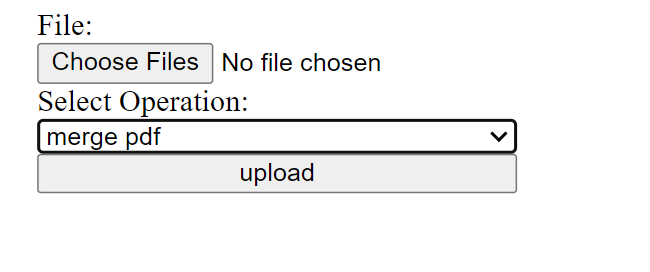
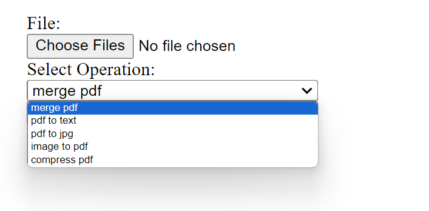

# ilovepdfAPI

## Requirements
- Python3 / Anaconda3
- [I love Pdf API reference](https://developer.ilovepdf.com/docs/api-reference)

## Features:
- merge two pdf
- extract text from pdf and save into text file
- images to pdf
- pdf to image
- compress pdf file
  
## Screenshots

